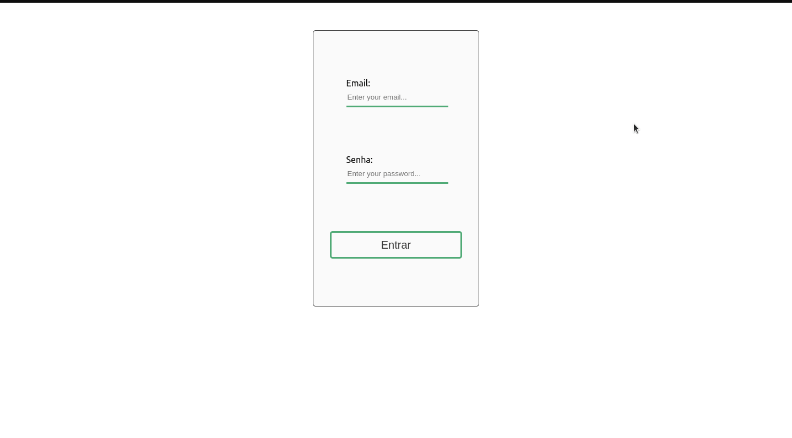

# TrybeWallet

  
  

TrybeWallet é um projeto que desenvolvi durante o módulo de Front-end na Trybe. O principal objetivo era colocar em prática os, recem aprendidos, conceitos de Redux.

O app tem o intuito de simular uma carteira de controle de gastos, criando uma tabela com  um valor em BRL (Real Brasileiro) convertido para uma moeda extrangeira. Esses dados são fornecidos pelo usuário, que também pode adicionar descrições sobre esse gasto.

<!-- inserir imagem de preview aqui -->

---

# Tecnologias

# Como usar

Este projeto está hospedado no seguinte domínio: link. Você pode acessá-lo direto pelo seu navegador, não é recomendado acessar pelo celular pois ele não possui design responsivo.

Caso queira acessar o código direto em sua máquina, você pode clonar o repositório, para isso siga os passos a seguir:

  1. Clone o repositório:

          git clone git@github.com:LaizaBertelli/trybewallet.git
  2. Entre no diretório do projeto e instale as dependências:

          cd trybewallet && npm install

  3. Inicie o projeto ou abra o seu editor de preferência

          npm start
  